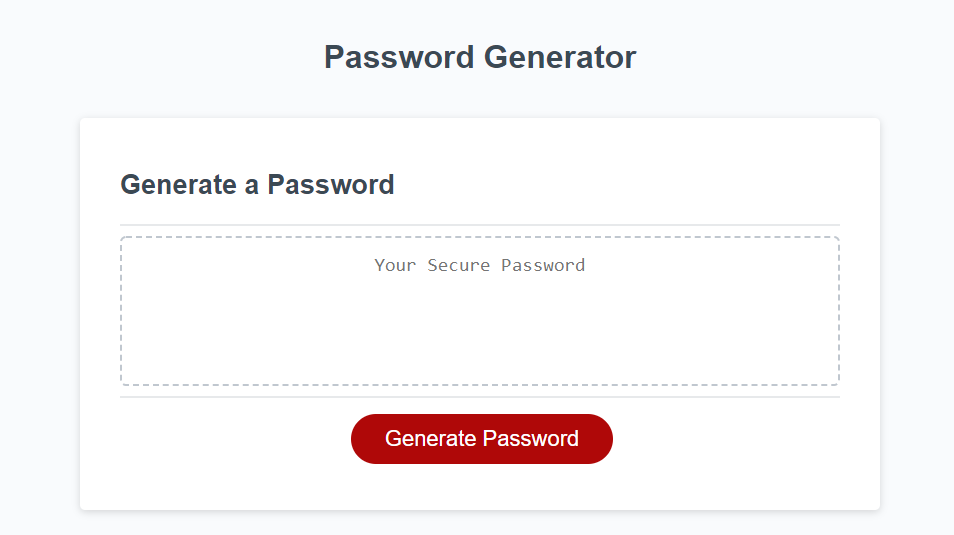

# password-generator
## Description
Given the intial HTML and CSS of the website, I created a password generator. The generator asks which type of characters should be used when generatoring the password and also asks for a length for the password.
## Table of Contents (Optional)
If your README is long, add a table of contents to make it easy for users to find what they need.
- [Installation](#installation)
- [Usage](#usage)
- [How to Contribue](#how-to-contribute)
- [Tests](#tests)
## Installation
N/A
## Usage
Visit the website here: https://markcirineo.github.io/password-generator/

## How to Contribute
You can contact me here: markcirineo22@gmail.com
## Tests
N/A